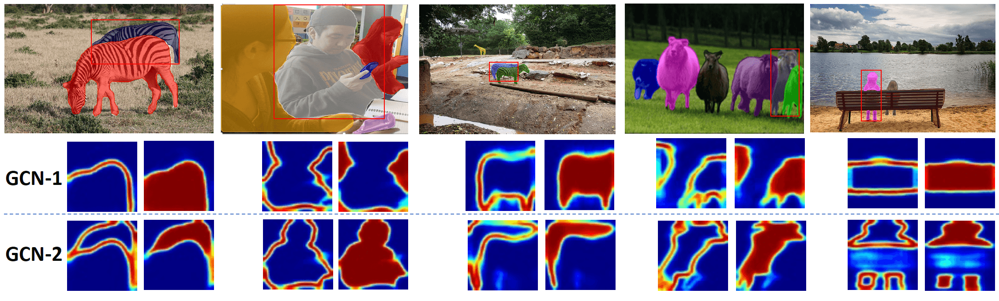
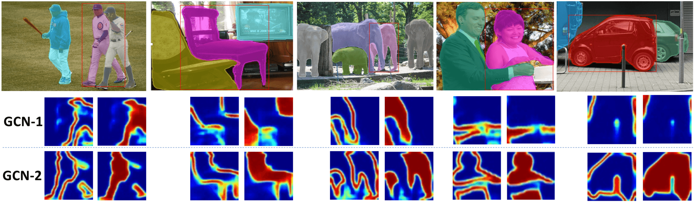
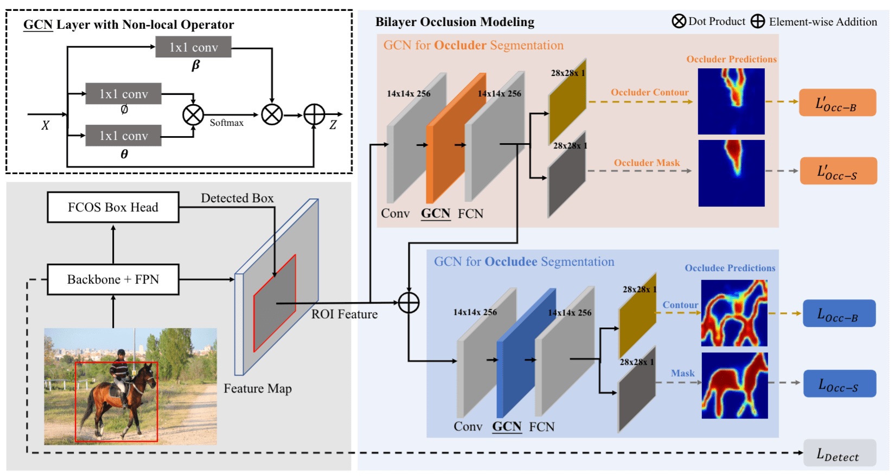
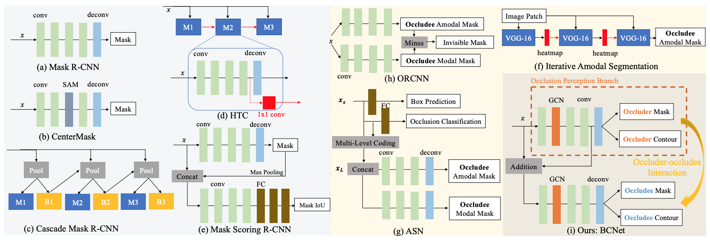

# Deep Occlusion-Aware Instance Segmentation with Overlapping BiLayers [BCNet, CVPR 2021]

[](https://opensource.org/licenses/MIT)
[](https://paperswithcode.com/sota/instance-segmentation-on-coco?p=deep-occlusion-aware-instance-segmentation)
[](https://paperswithcode.com/sota/instance-segmentation-on-kins?p=deep-occlusion-aware-instance-segmentation)

This is the official pytorch implementation of [BCNet](https://openaccess.thecvf.com/content/CVPR2021/papers/Ke_Deep_Occlusion-Aware_Instance_Segmentation_With_Overlapping_BiLayers_CVPR_2021_paper.pdf) built on the open-source detectron2.

> [**Deep Occlusion-Aware Instance Segmentation with Overlapping BiLayers**](https://openaccess.thecvf.com/content/CVPR2021/papers/Ke_Deep_Occlusion-Aware_Instance_Segmentation_With_Overlapping_BiLayers_CVPR_2021_paper.pdf)           
> Lei Ke, Yu-Wing Tai, Chi-Keung Tang  
> CVPR 2021

Highlights
-----------------
- **BCNet:** Two/one-stage (detect-then-segment) instance segmentation with state-of-the-art performance.
- **Novelty:** A new mask head design, explicit occlusion modeling with **bilayer decouple (object boundary and mask)** for the occluder and occludee in the same RoI.
- **Efficacy:** Large improvements both the FCOS (anchor-free) and Faster R-CNN (anchor-based) detectors.
- **Simple:** Small additional computation burden and easy to use.

Visualization of Occluded Objects
-----------------
<table>
    <tr>
        <td><center>
            
Qualitative instance segmentation results of our BCNet, using ResNet-101-FPN and Faster R-CNN detector. The bottom row visualizes squared heatmap of **object contour and mask predictions** by the two GCN layers for the occluder and occludee in **the same ROI region** specified by the red bounding box, which also makes the final segmentation result of BCNet more explainable than previous methods. The heatmap visualization of GCN-1 in fourth column example shows that **BCNet handles multiple occluders with in the same RoI by grouping them together**. See our paper for more visual examples and comparisons.
          </center></td>
</tr>
</table>
<table>
    <tr>
          <td><center>
              
Qualitative instance segmentation results of our BCNet, using ResNet-101-FPN and FCOS detector.
          </center></td>
</tr>
</table>

Results on COCO test-dev
------------
(Check Table 8 of the paper for full results, all methods are trained on COCO train2017)

Detector(Two-stage) | Backbone  | Method | mAP(mask) |
|--------|----------|--------|-----------|
Faster R-CNN| Res-R50-FPN | Mask R-CNN (ICCV'17) | 34.2 |
Faster R-CNN| Res-R50-FPN | PANet (CVPR'18) | 36.6 |
Faster R-CNN| Res-R50-FPN | MS R-CNN (CVPR'19) | 35.6 |
Faster R-CNN| Res-R50-FPN | PointRend (1x CVPR'20) | 36.3 |
**Faster R-CNN**| **Res-R50-FPN** | **BCNet (CVPR'21)** | [**38.4**](scores/stdout_r50_frcnn.txt) | 
Faster R-CNN| Res-R101-FPN | Mask R-CNN (ICCV'17) | 36.1 | 
Faster R-CNN| Res-R101-FPN | MS R-CNN (CVPR'19) | 38.3 |
Faster R-CNN| Res-R101-FPN | BMask R-CNN (ECCV'20) | 37.7 | 
**Box-free** | Res-R101-FPN | SOLOv2 (NeurIPS'20) | 39.7 | 
**Faster R-CNN**|**Res-R101-FPN** | **BCNet (CVPR'21)** | [**39.8**](scores/stdout_frcnn.txt)|

Detector(One-stage) | Backbone | Method | mAP(mask) |
|--------|----------|--------|-----------|
FCOS| Res-R101-FPN | BlendMask (CVPR'20) | 38.4 | 
FCOS| Res-R101-FPN | CenterMask (CVPR'20) | 38.3 | 
FCOS| Res-R101-FPN | SipMask (ECCV'20) | 37.8 |
FCOS| Res-R101-FPN | CondInst (ECCV'20) | 39.1 |
**FCOS**| Res-R101-FPN | **BCNet (CVPR'21)**| [**39.6**](scores/stdout_fcos.txt), [Pretrained Model](https://hkustconnect-my.sharepoint.com/:u:/g/personal/lkeab_connect_ust_hk/EfiDFLLEawFJpruwuOl3h3ABBjAKysTf0qJQU80iaKbqYg?e=igzC51), [Submission File](https://hkustconnect-my.sharepoint.com/:u:/g/personal/lkeab_connect_ust_hk/EVgMSMFwOmVDjAIB3LFusAMBTyTY-N_6qWbAWEBq_PK9xQ?e=5Lrmv7)|
FCOS|Res-X101 FPN| BCNet (CVPR'21) | [41.2](scores/stdout_fcos_x101.txt) |

Introduction
-----------------
Segmenting highly-overlapping objects is challenging, because typically no distinction is made between real object contours and occlusion boundaries. Unlike previous two-stage instance segmentation methods, **BCNet** models image formation as composition of two overlapping image layers, where the top GCN layer detects the occluding objects (occluder) and the bottom GCN layer infers partially occluded instance (occludee). **The explicit modeling of occlusion relationship with bilayer structure naturally decouples the boundaries of both the occluding and occluded instances, and considers the interaction between them during mask regression.** We validate the efficacy of bilayer decoupling on both one-stage and two-stage object detectors with different backbones and network layer choices. The network of BCNet is as follows:
<center>
<table>
    <tr>
          <td><center></center></td>
    </tr>
</table>
A brief comparison of mask head architectures, see our paper for full details.
<table>	
    <tr>
          <td><center></center></td>
    </tr>
</table>
</center>

## Step-by-step Installation
```
conda create -n bcnet python=3.7 -y
source activate bcnet
 
conda install pytorch==1.4.0 torchvision==0.5.0 cudatoolkit=10.1 -c pytorch
 
# FCOS and coco api and visualization dependencies
pip install ninja yacs cython matplotlib tqdm
pip install opencv-python==4.4.0.40
# Boundary dependency
pip install scikit-image
 
export INSTALL_DIR=$PWD
 
# install pycocotools. Please make sure you have installed cython.
cd $INSTALL_DIR
git clone https://github.com/cocodataset/cocoapi.git
cd cocoapi/PythonAPI
python setup.py build_ext install
 
# install BCNet
cd $INSTALL_DIR
git clone https://github.com/lkeab/BCNet.git
cd BCNet/
python3 setup.py build develop
 
unset INSTALL_DIR
```


## Dataset Preparation
Prepare for [coco2017](http://cocodataset.org/#home) dataset following [this instruction](https://github.com/facebookresearch/detectron2/tree/master/datasets). And use our converted mask annotations ([google drive](https://drive.google.com/file/d/1F2ClhTH5vZNlYvAqQhFQ3TVAbfbYp02y/view?usp=sharing) or [onedrive](https://hkustconnect-my.sharepoint.com/:u:/g/personal/lkeab_connect_ust_hk/EW2ZVyev7e5Pr1fVfF2nn18BRod82j_jW5Z4ywYd1evq8Q?e=qj0Bbm)) to replace original annotation file for bilayer decoupling training.

```
  mkdir -p datasets/coco
  ln -s /path_to_coco_dataset/annotations datasets/coco/annotations
  ln -s /path_to_coco_dataset/train2017 datasets/coco/train2017
  ln -s /path_to_coco_dataset/test2017 datasets/coco/test2017
  ln -s /path_to_coco_dataset/val2017 datasets/coco/val2017
```

Multi-GPU Training and evaluation on Validation set
---------------
```
bash all.sh
```
Or
```
CUDA_VISIBLE_DEVICES=0,1 python3 tools/train_net.py --num-gpus 2 \
	--config-file configs/fcos/fcos_imprv_R_50_FPN.yaml 2>&1 | tee log/train_log.txt
```

Pretrained Models
---------------
FCOS-version download: [link](https://hkustconnect-my.sharepoint.com/:u:/g/personal/lkeab_connect_ust_hk/EfiDFLLEawFJpruwuOl3h3ABBjAKysTf0qJQU80iaKbqYg?e=igzC51)
```
  mkdir pretrained_models
  #And put the downloaded pretrained models in this directory.
```

Testing on Test-dev
---------------
```
export PYTHONPATH=$PYTHONPATH:`pwd`
CUDA_VISIBLE_DEVICES=0,1 python3 tools/train_net.py --num-gpus 2 \
	--config-file configs/fcos/fcos_imprv_R_101_FPN.yaml \
	--eval-only MODEL.WEIGHTS ./pretrained_models/xxx.pth 2>&1 | tee log/test_log.txt
```

Visualization
---------------
```
bash visualize.sh
```

Reference script for producing bilayer mask annotation:
---------------
```
bash process.sh
```

The COCO-OCC split:
---------------
The COCO-OCC split download: [link](https://hkustconnect-my.sharepoint.com/:u:/g/personal/lkeab_connect_ust_hk/Eee8WYEY4plIko4X5ej4ahYBB28FEHfxxolxtEkhF8QbRg?e=5d000r), which is detailed described in paper.

Citation
---------------
If you find BCNet useful in your research or refer to the provided baseline results, please star :star: this repository and consider citing :pencil::
```
@inproceedings{ke2021bcnet,
    author = {Ke, Lei and Tai, Yu-Wing and Tang, Chi-Keung},
    title = {Deep Occlusion-Aware Instance Segmentation with Overlapping BiLayers},
    booktitle = {CVPR},
    year = {2021}
}  
```
Related high-quality instance segmentation work:
```
@inproceedings{transfiner,
    author={Ke, Lei and Danelljan, Martin and Li, Xia and Tai, Yu-Wing and Tang, Chi-Keung and Yu, Fisher},
    title={Mask Transfiner for High-Quality Instance Segmentation},
    booktitle = {CVPR},
    year = {2022}
}
```

Related occlusion handling work:
```
@inproceedings{ke2021voin,
  author = {Ke, Lei and Tai, Yu-Wing and Tang, Chi-Keung},
  title = {Occlusion-Aware Video Object Inpainting},
  booktitle = {ICCV},
  year = {2021}
}
```
Related Links
---------------
[Youtube Video](https://www.youtube.com/watch?v=iHlGJppJGiQ) | [Poster](http://www.kelei.site/poster/BCNet_CVPR21.pdf)|
[Zhihu Reading](https://zhuanlan.zhihu.com/p/378269087)

Related CVPR 2022 Work on high-quality instance segmentation: [Mask Transfiner](https://github.com/SysCV/transfiner)

Related NeurIPS 2021 Work on multiple object tracking & segmentation: [PCAN](https://github.com/SysCV/pcan)

Related ECCV 2020 Work on partially supervised instance segmentation: [CPMask](https://www.ecva.net/papers/eccv_2020/papers_ECCV/papers/123530375.pdf)


License
---------------
BCNet is released under the MIT license. See [LICENSE](LICENSE) for additional details.
Thanks to the Third Party Libs
[detectron2](https://github.com/facebookresearch/detectron2).   

Questions
---------------
Leave github issues or please contact 'lkeab@cse.ust.hk'
